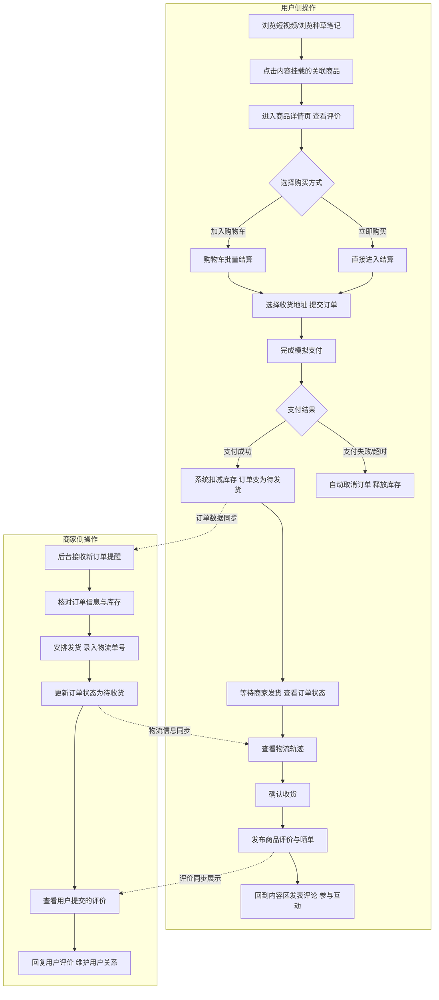

课程名:微服务开发与实践课程
姓名:李静静
学号:2423040405
用途:提交作业

项目名称：Kitty 主题女性垂类内容带货电商系统
项目简介：一款以 Hello Kitty 为视觉主题、聚焦 18-60 岁女性垂类市场的内容带货型自营电商系统，也是专为课程设计打造的全链路电商实战项目。项目以 “内容种草 + 交易闭环” 为核心模式，覆盖短视频带货、图文笔记种草、商品交易、订单履约、售后评价全业务流程，适配单人商家轻量化运营需求，同时具备清晰的架构分层与可扩展能力，可支撑从单体到分布式的全阶段课程学习。
业务背景：随着 “她经济” 的持续升温，18-60 岁女性群体已成为美妆、服饰、母婴品类的核心消费主力；同时短视频种草、图文笔记测评已成为女性用户消费决策的核心入口，内容与交易一体化的电商模式，转化效率远高于传统货架电商。
对于个人单打独斗的垂直类商家而言，入驻第三方主流电商平台存在佣金高、流量分发不可控、用户私域沉淀难等问题；而普通自建商城系统大多仅具备基础货架交易能力，缺少内容带货模块，且后台功能冗余复杂，难以适配单人运营的轻量化需求。此外，女性用户普遍对高颜值、有情感共鸣的主题化购物体验偏好更强，通用电商界面缺乏辨识度与用户粘性。
Hello Kitty 作为全球认知度极高的女性向 IP，覆盖全年龄段女性受众。以 Kitty 为视觉主题打造沉浸式购物体验，能够快速建立品牌好感度，强化用户情感连接，提升用户复购与留存。
目标用户：18-60 岁女性

功能模块详细描述

打造以 Hello Kitty 为视觉主题、聚焦 18-60 岁女性垂类市场的内容+ 交易一体化自营电商系统，打通 “短视频 / 图文笔记种草→下单支付→履约配送→评价互动” 的完整业务闭环。解决单人商家多平台运营分散、用户转化路径长、购物体验同质化的痛点，实现内容带货转化率提升、运营效率提升、用户粘性提升三大业务价值。

构建模块化、低耦合、可演进的单体电商架构，完整覆盖电商核心业务全链路；预留分布式扩展能力，可平滑支撑数据库持久化、服务拆分、认证授权、消息队列、分布式事务、系统监控、容器化部署等全阶段课程实训，兼顾开发效率与技术进阶价值。

适用场景

1. 单人运营美妆、服饰、母婴品类的垂直类商家，通过一套系统完成内容发布、商品管理、订单履约、用户互动全流程，无需在多平台间切换操作。
2. 以短视频、图文笔记为种草入口，内容直接挂载关联商品，实现 “看到即买到” 的短路径转化，大幅缩短用户决策路径，降低跳转流失率。
3. 商家沉淀自有用户，通过优质内容与评价互动建立用户信任，形成 “种草 - 消费 - 口碑 - 复购” 的正向循环，摆脱第三方平台流量依赖。

| 用户角色                  | 角色定位     | 核心需求                                                     |
| ------------------------- | ------------ | ------------------------------------------------------------ |
| 终端消费者（18-60岁女性） | 核心付费用户 | Kitty主题沉浸式体验；短视频/笔记种草；便捷下单；订单物流追踪；评价互动 |
| 自营商家管理员            | 唯一运营主体 | 一站式管理后台；商品/订单/内容/评价统一管理；经营数据查看    |
| 游客用户                  | 潜在转化群体 | 免登录浏览内容与商品；低门槛体验                             |

```mermaid
graph TD
    A[Kitty蜜选电商系统] --> B[C端用户购物端]
    A --> C[B端商家管理端]
    A --> D[基础支撑层]

    %% C端模块
    B --> B1[内容种草模块]
    B1 --> B11[短视频带货]
    B1 --> B12[图文笔记带货]
    B1 --> B13[商品挂载跳转]
    B1 --> B14[评论互动]

    B --> B2[商品交易模块]
    B2 --> B21[分类浏览与搜索]
    B2 --> B22[商品详情展示]
    B2 --> B23[购物车管理]
    B2 --> B24[结算与模拟支付]

    B --> B3[订单履约模块]
    B3 --> B31[订单全状态管理]
    B3 --> B32[物流信息追踪]
    B3 --> B33[收货与售后]
    B3 --> B34[评价晒单]

    B --> B4[个人中心模块]
    B4 --> B41[个人信息维护]
    B4 --> B42[收货地址管理]
    B4 --> B43[我的订单]
    B4 --> B44[我的收藏与评价]

    %% B端模块
    C --> C1[商品库存管理模块]
    C1 --> C11[商品信息管理]
    C1 --> C12[SKU规格管理]
    C1 --> C13[库存盘点与预警]
    C1 --> C14[商品上下架]

    C --> C2[订单物流管理模块]
    C2 --> C21[订单查询与筛选]
    C2 --> C22[订单详情与处理]
    C2 --> C23[发货与物流录入]
    C2 --> C24[售后处理]

    C --> C3[内容运营管理模块]
    C3 --> C31[短视频管理]
    C3 --> C32[图文笔记管理]
    C3 --> C33[商品关联挂载]
    C3 --> C34[内容评论管理]

    C --> C4[评价互动管理模块]
    C4 --> C41[商品评价查看]
    C4 --> C42[评价回复与管理]

    C --> C5[数据概览模块]
    C5 --> C51[核心经营指标]
    C5 --> C52[基础数据趋势]

    %% 基础支撑
    D --> D1[用户注册登录]
    D --> D2[角色权限控制]
    D --> D3[数据持久化存储]
    D --> D4[支付模拟接口]
    D --> D5[物流模拟接口]
```

功能图如上

### C 端用户购物端

#### （1）内容种草模块

系统核心差异化模块，是用户购物决策的核心入口。

- **短视频带货**
  - 沉浸式上下滑流：采用类抖音上下滑动交互，支持自动播放、暂停、静音切换，适配碎片化浏览习惯
  - 商品挂载卡片：每条短视频底部挂载 1-3 件关联商品，展示主图、名称、特惠价，点击直接跳转商品详情页
  - 互动操作：登录用户可点赞、收藏、发表评论，评论公开展示，支持楼中楼回复
  - 分类筛选：按美妆、服饰、母婴三大品类标签筛选对应短视频
- **图文笔记带货**
  - 双列瀑布流展示：笔记封面 + 标题预览，适配女性用户图文浏览偏好
  - 笔记详情页：支持多图轮播、长文正文、话题标签，正文内嵌入商品标签
  - 一键跳转下单：笔记内的商品卡片可直接点击跳转商品详情，完成加购
  - 互动能力：支持点赞、收藏、评论，优质评论可被商家置顶
- **评论互动体系**：所有内容评论公开可见，登录用户均可发表；评论支持按热度、时间排序，违规评论商家可隐藏。

#### （2）商品交易模块

电商核心基础模块，承载商品浏览与下单转化。

- **分类浏览与搜索**
  - 三级分类体系：一级分类（美妆 / 服饰 / 母婴）→二级分类（如护肤 / 彩妆 / 香氛）→三级细分
  - 关键词搜索：支持按商品名称、描述关键词模糊搜索
  - 筛选排序：支持按价格、销量、新品排序，按价格区间、规格筛选
- **商品详情页**
  - 信息展示：商品轮播主图、价格、库存、规格选项、详情图文描述
  - 评价入口：底部展示商品评价列表，可查看全部用户评价与晒单
  - 操作按钮：加入购物车、立即购买两个核心转化入口
- **购物车管理**
  - 基础操作：加入商品、修改购买数量、删除商品、全选 / 反选
  - 结算能力：批量结算、实时计算商品总价与优惠
  - 库存校验：结算时校验商品库存与上下架状态，异常商品自动提示
- **结算与模拟支付**
  - 订单确认：选择收货地址、确认商品明细与金额
  - 提交订单：生成订单号，锁定对应商品库存
  - 模拟支付：对接模拟支付接口，支持支付成功 / 失败场景模拟；支付成功自动更新订单状态，扣减库存；支付超时自动取消订单并释放库存。

#### （3）订单履约模块

覆盖订单从生成到完成的全生命周期。

- **订单全状态管理**：支持 5 种核心订单状态流转
  - 待付款：提交订单未支付，支持取消订单
  - 待发货：支付成功，等待商家发货
  - 待收货：商家已发货，等待用户确认
  - 已完成：用户确认收货，交易完成
  - 已取消：主动取消或超时取消
- **物流信息追踪**
  - 展示物流公司、物流单号
  - 模拟物流轨迹节点：已发货→运输中→派送中→已签收
- **收货与售后**
  - 确认收货：手动点击确认，订单状态变更为已完成
  - 模拟售后：已完成订单可提交售后申请，商家后台处理
- **评价晒单**：确认收货后可发布评价，支持星级评分 + 文字描述 + 图片晒单；评价同步展示在商品详情页，作为其他用户的决策参考。

#### （4）个人中心模块

用户个人资产与信息管理中心。

- 个人信息维护：头像、昵称设置，基础信息修改
- 收货地址管理：新增、编辑、删除地址，设置默认收货地址
- 我的订单：按状态筛选订单，查看订单详情、物流信息，进行收货、评价操作
- 我的收藏：统一管理收藏的短视频、笔记、商品
- 我的评价与评论：查看自己发布的商品评价、内容评论，支持删除

###  B 端商家管理端

单人运营专属后台，一站式覆盖全经营流程。

#### （1）商品库存管理模块

- **商品信息管理**：新增、编辑、删除商品，设置商品名称、分类、主图、详情图、商品描述、售价
- **SKU 规格管理**：为商品设置多规格（如颜色、尺码、容量），不同规格对应独立库存与价格
- **库存管理**：手动调整库存数量；设置库存预警阈值，库存低于阈值时红色高亮提醒；库存变动记录可查
- **商品上下架**：一键上下架操作；下架商品用户端不可见，不可下单

#### （2）订单物流管理模块

- **订单查询与筛选**：按订单号、用户手机号、订单状态、下单时间筛选查询
- **订单详情处理**：查看订单商品明细、收货地址、支付信息；待发货订单可修改价格、备注
- **发货与物流录入**：点击发货，选择物流公司、录入物流单号，订单状态自动变更为待收货，同步通知用户
- **售后处理**：查看用户售后申请，审核处理退款 / 退货，同步更新订单状态

#### （3）内容运营管理模块

- **短视频管理**：上传短视频文件、设置封面与标题、选择关联商品；支持发布、下架、编辑操作
- **图文笔记管理**：编辑笔记正文、上传配图、设置话题标签、挂载关联商品；支持草稿保存、发布、下架
- **商品关联挂载**：每条内容可选择 1-3 件商品绑定，支持调整商品展示顺序
- **内容评论管理**：查看所有内容的用户评论，支持回复评论、删除违规评论、置顶优质评论

#### （4）评价互动管理模块

- 商品评价查看：按商品、评分、时间筛选查看所有用户评价
- 评价管理：回复用户评价、置顶优质评价、屏蔽恶意评价
- 评价统计：直观展示商品好评率、评价数量

#### （5）数据概览模块

- 核心经营指标：订单总量、销售总额、商品总数、用户总数
- 基础数据趋势：近 7 天订单量、销量趋势展示，辅助商家掌握经营情况

### 基础支撑模块

- 用户注册登录：支持手机号注册、账号密码登录；游客模式浏览
- 角色权限控制：区分游客、普通用户、商家管理员三种角色，不同角色访问不同功能范围
- 数据持久化：MySQL 存储全业务数据，保证数据可靠存储
- 模拟接口：支付模拟接口、物流模拟接口，支撑完整业务流程跑通

## 核心业务完整流程

###  内容种草→下单支付→履约评价全链路流程

这是系统最核心的业务闭环，完整覆盖从用户种草到复购的全路径：

**流程说明**：

1. 用户以内容为入口完成种草，无需跳转平台即可直接进入商品下单，转化路径最短
2. 提交订单时锁定库存，支付成功正式扣减，有效避免超卖问题
3. 商家在后台一站式完成订单处理、发货、售后、评价回复，无需多系统切换
4. 用户评价反向同步到商品详情和内容社区，形成口碑沉淀，带动后续用户转化，完成业务闭环

## 项目范围边界

###  当前一期实现范围

- **业务模式**：单人 B2C 自营模式，仅一个商家主体，不支持多商家入驻
- **核心功能**：短视频 / 笔记内容带货、商品管理、购物车、订单、模拟支付、物流追踪、评价评论全流程
- **管理能力**：商品、库存、订单、内容、评价、物流六大模块的基础管理
- **技术架构**：Spring Boot 单体架构、MySQL 数据持久化、基础角色权限区分、Docker 化中间件部署
- **交互能力**：基础评论互动、评价晒单，无复杂社交功能

### 暂不实现内容

- **平台类模式**：多商家入驻、平台抽佣、商家结算、店铺装修
- **复杂营销工具**：直播带货、拼团、秒杀、优惠券、满减、分销返利、会员体系
- **真实第三方对接**：真实支付渠道、真实物流 API、短信服务、第三方登录、云存储
- **智能算法能力**：个性化推荐算法、用户画像、大数据分析、智能客服
- **高级架构能力**：微服务拆分、消息队列、分布式事务、全链路监控、集群部署（留待后续课程逐步实现）

## 后续技术演进路线

项目采用**单体起步、逐步演进**的思路，可平滑对接后续全部课程任务，每一步都有明确的业务场景与技术落地点：

### 1. 认证与授权方向

- 实现**JWT 无状态统一认证**，替换原有 Session 方案，支持跨服务鉴权
- 基于**RBAC 权限模型**，细化游客、普通用户、商家管理员三级权限，实现接口级权限控制
- 接入**Redis**存储 Token 与黑名单，实现 Token 过期刷新、主动登出、会话管理功能

### 2. 服务拆分方向

- 将单体架构按业务域拆分为 6 个独立微服务：用户服务、商品服务、订单服务、内容服务、评价服务、支付服务
- 引入**Spring Cloud Gateway**服务网关，实现统一路由、全局鉴权、限流熔断
- 服务间通过**OpenFeign**进行远程调用，实现服务解耦、独立开发、独立部署

### 3. 消息队列方向

- 引入**RabbitMQ**消息中间件，实现核心业务异步解耦与流量削峰
- 落地典型业务场景：
  - 订单超时自动取消：下单后发送延迟消息，超时未支付自动取消订单并释放库存
  - 物流状态推送：物流更新时发送消息，实时推送到用户端
  - 评价提醒：确认收货后发送消息，定时提醒用户评价
- 实践消息确认机制、死信队列、消息幂等性处理

### 4. 分布式事务方向

- 针对 “下单扣减库存”“支付成功更新订单 + 扣减库存” 等跨服务核心场景
- 采用**Seata**框架实现 AT 模式分布式事务，保证多服务间的数据最终一致性
- 对比 TCC、可靠消息最终一致性等方案，分析不同业务场景的选型策略

### 5. 系统监控方向

- 引入**Prometheus + Grafana**搭建监控体系，实现可视化监控大盘
- 监控维度：接口响应时间、吞吐量、错误率，JVM 运行状态，数据库连接池，容器 CPU / 内存使用率
- 集成日志采集方案，实现全链路日志追踪与异常告警
- 配置业务指标监控：订单量、支付成功率、库存预警、内容播放量

### 6. 容器化部署方向

- 所有服务编写**Dockerfile**，构建标准化镜像，实现开发、测试、生产环境一致性
- 采用**Docker Compose**一键编排全系统所有服务与中间件
- 接入**Nginx**反向代理，实现静态资源托管、负载均衡、接口转发
- 实践蓝绿部署、滚动发布等基础部署策略